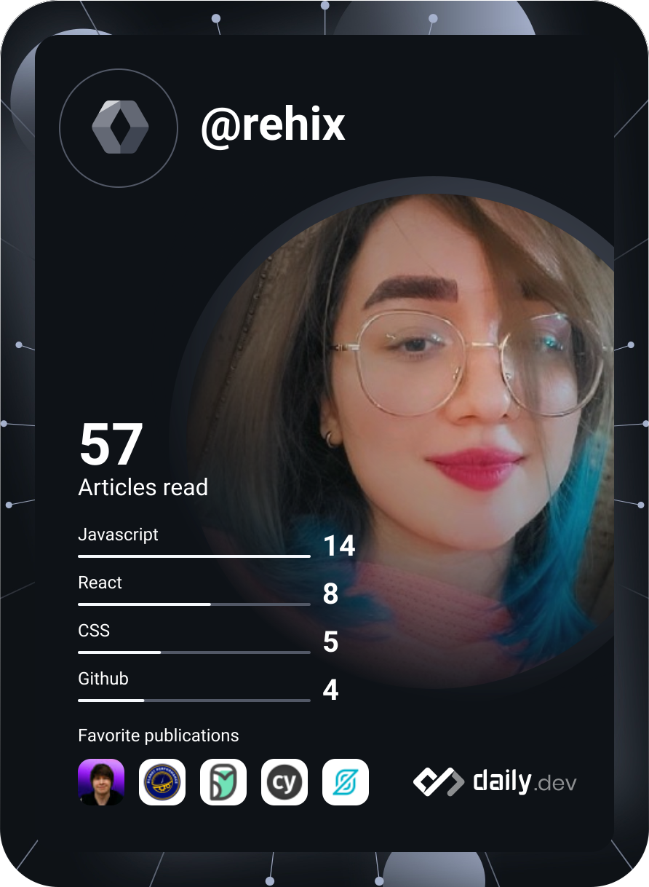

<h1 align="center">Hi 👋, I'm Reyhaneh</h1>
<h3 align="center">Frontend developer building engaging web experiences</h3>

  

## About me

- 🌱 Passionate about building clean, interactive, and user-focused interfaces
- 💬 Ask me about **Vue.js** and **Three.js**
- 📫 Reach me at **reyhaneh.rad.dev@gmail.com**

## Connect with me

[LinkedIn](https://linkedin.com/in/reyhaneh-moayerirad/)

## Languages and tools

  
  
  
  
  
  
  
  
  
  
  

## GitHub stats

  

  

## Dev card

  

