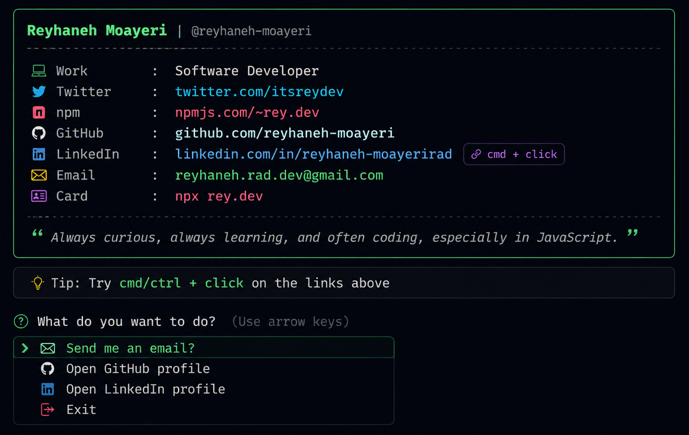

<h2>It's me, @Reyhaneh!</h2>
<p><em>Software Developer</br>
</em></p>

> Always curious, always learning, and often coding, especially in JavaScript.

[](https://skillicons.dev)

---

A little more about me... with npm installed, just type

```
npx rey.dev
```

